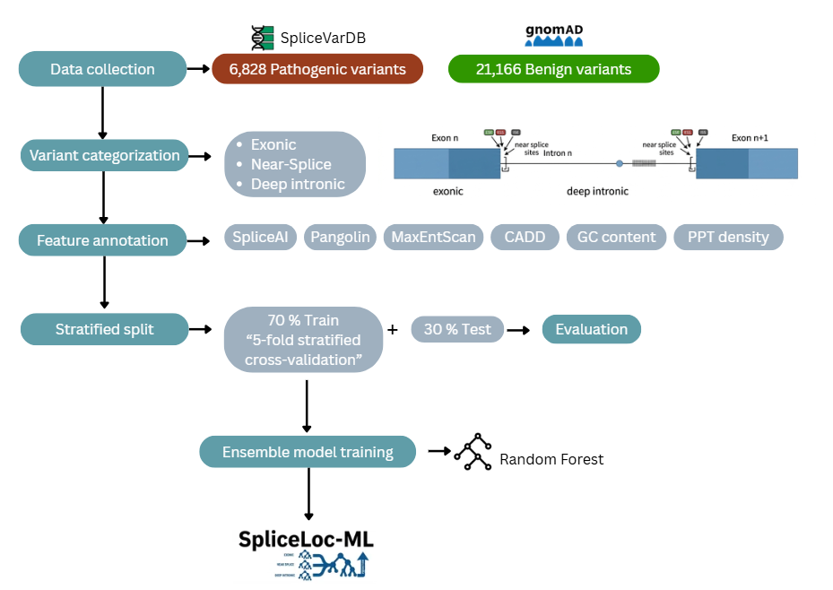

# SpliceLoc-ML

**A Location-Stratified Machine Learning Model for Non-Canonical Splice Variant Pathogenicity Prediction and Classification**




> Master's Thesis — Wedad Murar  
> Palestine Polytechnic University, Palestine-Korea Biotechnology Center  
> Supervisor: Dr. Yaqoub Ashhab

---

## What is SpliceLoc-ML?

Non-canonical splice variants, those occurring outside the invariant ±1/±2 splice site positions are a clinically significant but computationally neglected class of genetic variants. Existing tools either focus on one genomic region only, or apply a single universal model across all variant types, which leads to canonical bias and reduced sensitivity for exonic and deep intronic variants.

SpliceLoc-ML addresses this by training **three separate Random Forest models**, one per non-canonical genomic location category:

| Category | Definition |
|---|---|
| Exonic | Variants within exons other than canonical splice sites |
| Near-Splice | Variants 3–20 bp from a splice site |
| Deep Intronic | Variants > 20 bp from a splice site |

Each model outputs a **posterior probability** that maps directly onto the **ACMG/AMP five-tier classification system** (Pathogenic, Likely Pathogenic, VUS, Likely Benign, Benign), using thresholds from the Tavtigian et al. (2018) Bayesian framework.

---

## Model Performance

| Category | AUROC | Sensitivity | Specificity | PPV | NPV | MCC |
|---|---|---|---|---|---|---|
| Exonic | 0.969 | 0.866 | 0.966 | 0.961 | 0.880 | 0.837 |
| Near-Splice | 0.975 | 0.904 | 0.948 | 0.942 | 0.913 | 0.853 |
| Deep Intronic | 0.936 | 0.872 | 0.953 | 0.830 | 0.966 | 0.811 |

All three models exceed the minimum thresholds (AUROC ≥ 0.85, Sensitivity ≥ 0.80, MCC ≥ 0.50).

---

## Clinical Application

The model was applied as a proof of concept to **4,349 non-canonical splice variants** from 8 Long QT Syndrome (LQTS) genes: *KCNQ1, KCNH2, SCN5A, CALM1, CALM2, CALM3, KCNJ2, TRDN*.

**Key result:** VUS rate reduced from **11.2% → 4.9%** (56.6% reduction). 54 variants previously classified as VUS were reclassified as Likely Pathogenic or Pathogenic.

---

## Repository Structure

```
SpliceLoc-ML/
│
├── README.md
├── LICENSE                          
├── .gitignore                       
├── requirements.txt                 
│
├── models/
│   ├── rf_models.pkl                ← trained RF models (exonic, near-splice, deep intronic)
│   ├── rf_cutoffs_binary.pkl        ← Youden's J binary cutoffs per category
│   ├── rf_cutoffs_5tier.pkl         ← five-tier ACMG threshold values per category
│   └── rf_scalers.pkl               ← feature scalers
│
├── results/
│   ├── model_performance_summary.csv      ← full performance metrics table
│   └── reclassified_variants_5tier.csv    ← LQTS reclassification output
│
└── figures/
    ├── roc_curves.png               ← ROC curves for all three models
    ├── score_distribution.png       ← violin plots by true label
    ├── feature_importance.png       ← Gini feature importance per category
        ├── 5tier_distribution.png       ← five-tier ACMG classification distribution
    └── lab_validation_rates.png     ← detection rate by validation method
```

---

## Installation

```bash
git clone https://github.com/wedadmurar/SpliceLoc-ML.git
cd SpliceLoc-ML
pip install -r requirements.txt
```

---

## How to Use

### Step 1 — Annotate your variants with VEP

Run your variants through Ensembl VEP (v110, GRCh38) with the following plugins:
- SpliceAI (raw scores, unthresholded)
- MaxEntScan
- CADD (PHRED scores)

Then run Pangolin locally:
```bash
pangolin input.vcf output.vcf --mask True -d 300
```

### Step 2 — Load the model and predict

```python
import pickle
import pandas as pd

# Load models and thresholds
with open('models/rf_models.pkl', 'rb') as f:
    models = pickle.load(f)

with open('models/rf_cutoffs_binary.pkl', 'rb') as f:
    binary_cutoffs = pickle.load(f)

with open('models/rf_cutoffs_5tier.pkl', 'rb') as f:
    tier_cutoffs = pickle.load(f)

# Load your annotated variant dataframe
df = pd.read_csv('your_variants.csv')

# Predict — use the category-specific model
category = 'Near Splice (3-20 bp)'   # or 'Exonic' or 'Deep Intronic (>20 bp)'
model = models[category]

features = [
    'MaxEntScan_alt', 'MaxEntScan_ref', 'MaxEntScan_diff',
    'CADD_PHRED',
    'SpliceAI_pred_DS_AG', 'SpliceAI_pred_DS_AL',
    'SpliceAI_pred_DS_DG', 'SpliceAI_pred_DS_DL',
    'max_splice_val', 'ada_score', 'rf_score',
    'GC_content', 'PPT_density', 'Pangolin_score'
]

probabilities = model.predict_proba(df[features])[:, 1]

# Apply five-tier ACMG classification
t = tier_cutoffs[category]

def classify(p):
    if p >= t['T_pathogenic']:
        return 'Pathogenic'
    elif p >= t['T_likely_path']:
        return 'Likely Pathogenic'
    elif p >= t['T_vus_lower']:
        return 'VUS'
    elif p >= t['T_benign']:
        return 'Likely Benign'
    else:
        return 'Benign'

df['splicing_probability'] = probabilities
df['acmg_5tier'] = df['splicing_probability'].apply(classify)
```

---

## Five-Tier Classification Thresholds

| Category | T_benign | T_vus_lower | T_likely_path | T_pathogenic |
|---|---|---|---|---|
| Exonic | 0.10 | 0.5275 | 0.90 | 0.99 |
| Near-Splice | 0.10 | 0.4743 | 0.90 | 0.99 |
| Deep Intronic | 0.10 | 0.5125 | 0.90 | 0.99 |

Three thresholds (T_benign, T_likely_path, T_pathogenic) are published constants from Tavtigian et al. (2018).  
T_vus_lower was derived per category using Youden's J statistic on the training set ROC curve.

---

## Training Data

| Source | Purpose | Variants |
|---|---|---|
| SpliceVarDB (Sullivan et al., 2024) | Pathogenic positive controls | 6,828 experimentally validated splice-altering variants |
| gnomAD v4.1 (AF > 0.001) | Benign negative controls | 21,166 common population variants |

---

## Requirements

```
python==3.10
scikit-learn==1.0.2
imbalanced-learn==0.11
pandas==2.0
numpy==1.25
matplotlib==3.7
seaborn==0.12
shap==0.42
joblib
```

---

## Citation

If you use SpliceLoc-ML in your research, please cite:

> Murar, W. (2026). *SpliceLoc-ML: A location-stratified machine learning model for non-canonical splice variant pathogenicity prediction and classification, with application to Long QT Syndrome* [Master's thesis]. Palestine Polytechnic University.

```
@mastersthesis{murar2026splicelocml,
  author  = {Murar, Wedad},
  title   = {SpliceLoc-ML: A Location-Stratified Machine Learning Model for Non-Canonical Splice Variant Pathogenicity Prediction and Classification},
  school  = {Palestine Polytechnic University},
  year    = {2026}
}
```

---

## License

This project is licensed under the MIT License — see the [LICENSE](LICENSE) file for details.

---

## Contact

For questions about the model or results, please open a GitHub issue or contact the author through wedadmurar@ppu.edu.
